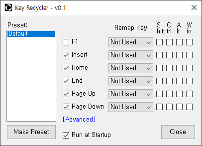

## What is this
Key Recycler is a Program that can disable useless keys or remap useful functions.

  

## How to run
You can download Release File and Source Code [Here](https://github.com/jfri13/Key-Recycler/releases).

**Method 1**. Download the Release File and Run it, SmartScreen will block it.

\
Click More Info and then Click Run Anyway.

 

**Method 2**. If you cannot download Release File, you can download the Source Code and Build it yourself.\
Open the Solution File in Visual Studio and Build it.\
Most of functions are included in Form1, and use it by modifying it as needed.\
There are no viruses in the code.

  

## How to use
\
By default, it can be applied to F1, Insert, Home, End, Page Up, Page Down.\
It's Activated by checking the checkbox beside the key.\
You can Select the Key to Remap and Modifier Keys.\
You can Make multiple settings as Presets.\
It can Run automatically when Windows Starts.

 

**Advanced Settings**\
To apply to other keys, use Advanced Settings.

\
You can Add Another Key by Right-Clicking on an Empty Area and clicking Add.

 

\
After selecting the added Item, Find the Key you want to apply from the List and Double-Click it.

 

\
Right-Click and Select Add Remap Key. Double-Click in the list to Apply the Key.\
You can add Modifier Keys and Delete Key.

 

Send Bug Reports or Suggestions to the Email below.

  

## Localization
English and Korean localization files are included by default.\
In Regions where Other Languages ​​are spoken, the Language Code will be Displayed beside the Program Title.

\
Copy the en.loc file in the Program Path, Rename it with Language Code, and Open the file with Notepad to make the appropriate changes.

 

If you send the completed Localization File, I want to Release it after checking it.

  

## Contact Info
* Email: jfri13@naver.com