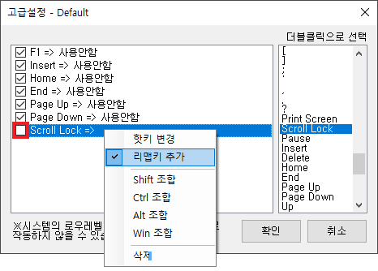

## 개요
Key Recycler는 쓸모없는 키를 비활성화하거나 유용한 기능으로 다시 매핑할 수 있는 프로그램입니다.

  

## 실행방법
[여기](https://github.com/jfri13/Key-Recycler/releases)에서 Release 파일 및 소스 코드를 다운로드할 수 있습니다.

**방법 1**. Release 파일을 다운로드하고 실행하면 SmartScreen이 차단합니다.

\
추가 정보를 클릭한 다음 실행을 클릭합니다.

 

**방법 2**. Release 파일을 다운로드할 수 없는 경우 소스 코드를 다운로드하여 직접 빌드할 수 있습니다.\
Visual Studio에서 솔루션 파일을 열고 빌드합니다.\
대부분의 기능은 Form1에 포함되어 있으며 필요에 따라 수정하여 사용합니다.\
코드에 바이러스는 없습니다.

  

## 사용방법
\
기본적으로 F1, Insert, Home, End, Page Up, Page Down에 적용할 수 있습니다.\
키이름 옆의 체크박스를 체크하면 활성화됩니다.\
리맵키 및 조합키를 선택할 수 있습니다.\
여러 설정을 프리셋으로 만들 수 있습니다.\
Windows 시작 시 자동으로 실행할 수 있습니다.

 

**고급설정**\
그외 키에 적용하려면 고급 설정을 사용하십시오.

\
빈 곳을 우클릭하고 추가를 클릭하여 다른 키를 추가할 수 있습니다.

 

\
추가된 항목을 선택한 후 목록에서 적용하고자 하는 키를 찾아 더블클릭합니다.

 

\
우클릭하고 리맵키 추가를 선택합니다. 목록을 더블클릭하여 키를 적용합니다.\
조합키를 추가하고 키를 삭제할 수도 있습니다.\
적용하려면 체크하여 활성화하는 것을 잊지 마십시오.

 

아래 이메일로 버그 보고서 또는 건의사항을 보내주세요.

  

## 현지화
영어 및 한국어 현지화 파일이 기본적으로 포함되어 있습니다.\
다른 언어를 사용되는 지역에서는 프로그램 제목 옆에 언어 코드가 표시됩니다.

\
프로그램 경로에서 en.loc 파일을 복사하고 언어 코드로 이름을 바꾼 다음 메모장으로 파일을 열어 적절하게 변경하십시오.

 

완성된 Localization 파일을 보내주시면 확인 후 배포하고 싶습니다.

  

## 연락처
* Email: jfri13@naver.com
* 티스토리: https://jfri13.tistory.com/